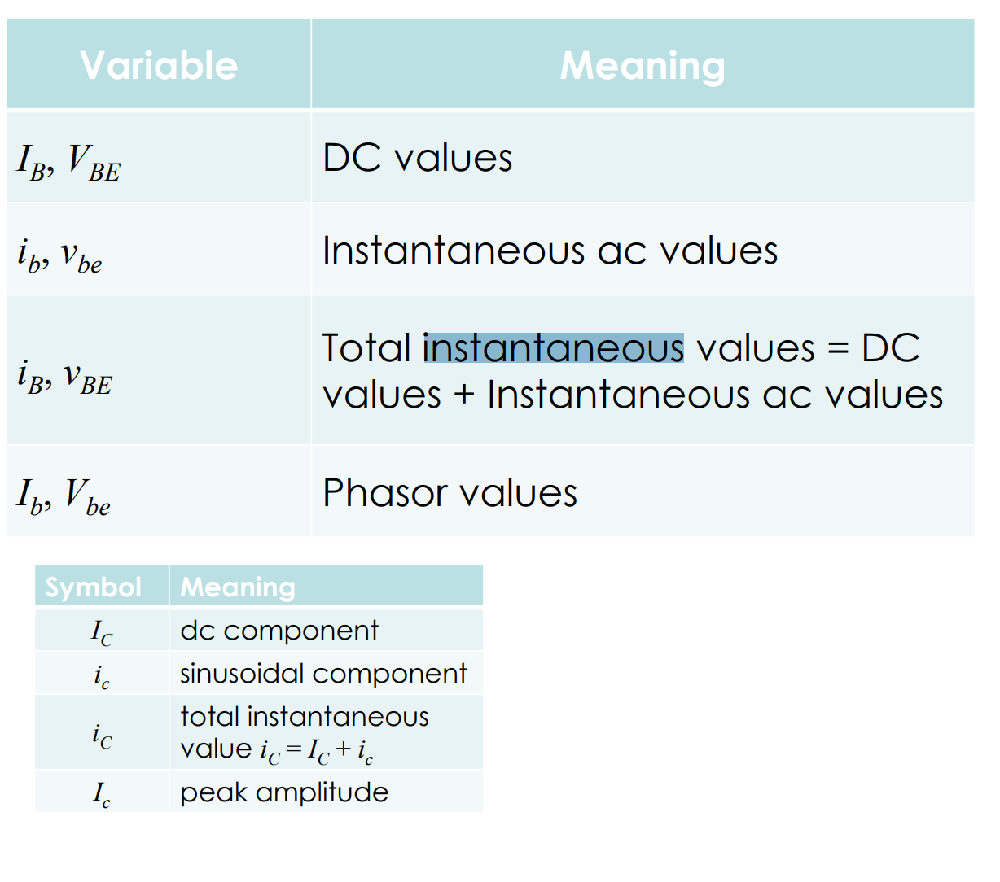

# ac-phase-calculator
[Phase angle calculation time delay frequency calculate phase lag time shift between voltage difference time of arrival ITD oscilloscope measure two signals formula angle current voltage phi phase shift time difference - sengpielaudio Sengpiel Berlin](https://sengpielaudio.com/calculator-timedelayphase.htm)

- http://www.physicsbootcamp.org/Circuit-Analysis-Using-Complex-Numbers.html
